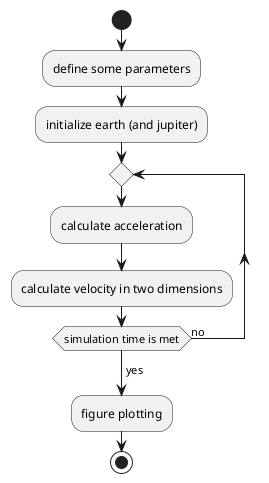

# Planning document

## Goal
- Planet project The climate last about 1 million years has been largely determined but the changte of the eccentricity (elongation) of Earth's orbit (One of th eMilankovitch cycles. 
- The glacial cycles (daily speaking: ice ages)

## Design
- Define constants
- Define initial values positions velocity (balance of gravity and centrifugal force
- (Allocate (book space for long vectors plan iteration)
- Iteration
   - Change of positions
   - Calc acc (gravity)
   - Calc the velocity
## Overview

