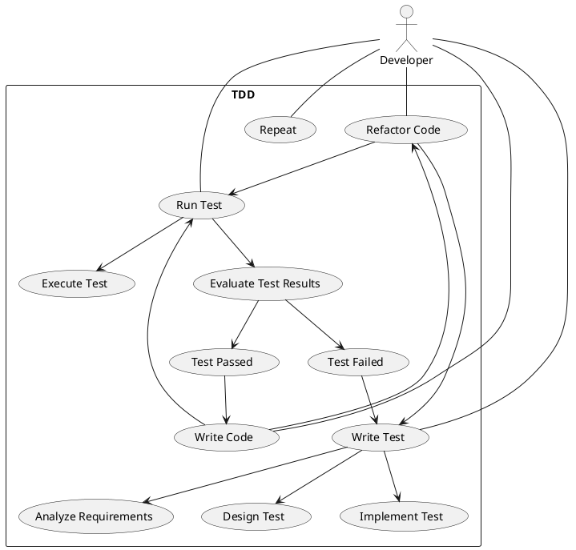

```plantuml
@startuml

actor Developer as Dev

rectangle TDD {
  Dev -- (Write Test)
  Dev -- (Run Test)
  Dev -- (Write Code)
  Dev -- (Refactor Code)
  Dev -- (Repeat)
  
  (Write Test) --> (Analyze Requirements)
  (Write Test) --> (Design Test)
  (Write Test) --> (Implement Test)
  (Run Test) --> (Execute Test)
  (Run Test) --> (Evaluate Test Results)
  (Evaluate Test Results) --> (Test Failed)
  (Evaluate Test Results) --> (Test Passed)
  (Test Failed) --> (Write Test)
  (Test Passed) --> (Write Code)
  (Write Code) --> (Run Test)
  (Write Code) --> (Refactor Code)
  (Refactor Code) --> (Run Test)
  (Refactor Code) --> (Write Test)
}
@enduml
```
